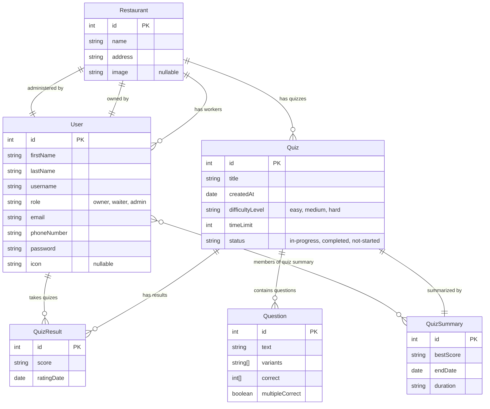

# Restaurant Management System API

A comprehensive restaurant management system built with NestJS, TypeScript, and PostgreSQL. This system provides staff training through quizzes, user role management, and image handling capabilities.

## 🚀 Features

- **User Management**: Multi-role system (Owner, Admin, Waiter) with JWT authentication
- **Restaurant Management**: Restaurant profiles with image upload support

- **Staff Training Platform**: Quiz system with multiple difficulty levels and progress tracking
- **Image Management**: Cloudinary integration for restaurant images
- **AI Integration**: OpenAI integration for enhanced quiz generation
- **Real-time Features**: Socket.io support for live updates
- **CSV Export/Import**: Quiz data management
- **Pagination**: Efficient data loading with nestjs-paginate

## 🛠️ Tech Stack

**Backend Framework:** NestJS (Node.js)  
**Language:** TypeScript  
**Database:** PostgreSQL  
**ORM:** TypeORM  
**Authentication:** JWT  
**File Upload:** Multer + Cloudinary  
**AI Integration:** OpenAI API  
**Real-time:** Socket.io  
**Testing:** Jest  
**Containerization:** Docker

## 🔐 Environment Variables

Copy `.env.example` to `.env` and configure the following variables:

| Variable                | Description                        | Required |
| ----------------------- | ---------------------------------- | -------- |
| `JWT_SECRET`            | JWT secret key                     | ✅       |
| `PORT`                  | Application port (default: 3000)   | ✅       |
| `DB_CONNECT`            | PostgreSQL connection string       | ✅       |
| `OPENAI_API_KEY`        | OpenAI API key for quiz generation | ✅       |
| `CLOUDINARY_CLOUD_NAME` | Cloudinary cloud name              | ✅       |
| `CLOUDINARY_API_KEY`    | Cloudinary API key                 | ✅       |
| `CLOUDINARY_API_SECRET` | Cloudinary API secret              | ✅       |

## Project setup

```bash
$ npm install
```

Create `.env` file from `.env.example` and configure environment variables

## Compile and run the project

```bash
# development
$ npm run start

# watch mode
$ npm run start:dev

# production mode
$ npm run start:prod
```

## 🐳 Docker Setup

The application includes Docker support for easy deployment:

### Development with Docker

```bash
# Start all services (app + database)
$ npm run start:docker

# Stop all services
$ npm run stop:prod:docker
```

### Production with Docker

```bash
$ npm run start:prod:docker
```

## 🧪 Testing

### Prerequisites

Start the test database:

```bash
$ npm run test:db
```

### Run Tests

```bash
# Unit tests
$ npm run test

# End-to-end tests
$ npm run test:e2e

# Test coverage report
$ npm run test:cov

# Watch mode for development
$ npm run test:watch
```

### Test Database

The application uses a separate PostgreSQL instance for testing to ensure data isolation.

## 📖 API Documentation

After starting the server, visit:

- **Swagger UI**: `http://localhost:3000/api`
- **API JSON**: `http://localhost:3000/api-json`

### Main Endpoints:

- `POST /auth/login` - User authentication
- `GET /restaurant` - Get restaurant information
- `POST /quiz` - Create staff training quiz
- `GET /quiz-results` - Get quiz performance data

## 📁 Project Structure

```
src/
├── auth/                 # Authentication module
├── restaurant/           # Restaurant management
│   ├── dto/             # Data transfer objects
│   ├── image/           # Image upload handling
│   └── workers/         # Staff management
├── quiz/                 # Quiz system
│   ├── dto/             # Quiz DTOs
│   └── openai/          # AI integration
├── quiz-results/         # Quiz performance tracking
├── quiz-summary/         # Quiz analytics
├── types/entity/         # TypeORM entities
├── shared-jwt-auth/      # Shared authentication
└── logger/              # Application logging
```

## Restaurant DataBase schema



## Entity Descriptions

### Core Entities

- **User**: Represents system users (owners, waiters, admins)
- **Restaurant**: Restaurant information and settings

### Quiz System Entities

- **Quiz**: Training quizes for staff with difficulty levels
- **Question**: Quiz questions with multiple choice answers
- **QuizResult**: Individual quiz attempt results
- **QuizSummary**: Aggregated quiz performance data

## Key Relationships

1. **Restaurant-User**: One restaurant has many workers, one owner, and optionally one admin
2. **Quiz-Question**: Each quiz contains multiple questions
3. **User-QuizResult**: Users can take multiple quizes
4. **Quiz-QuizSummary**: Each quiz has one summary with multiple member participants

## Business Logic Notes

- Users have roles: `owner`, `waiter`, `admin`
- Quiz system supports staff training with different difficulty levels
- Quiz results track individual performance over time

## 🔒 Security Features

- JWT-based authentication
- Password hashing with bcrypt
- Role-based access control
- Input validation with class-validator
- SQL injection protection via TypeORM

## ⚡ Performance Features

- Database connection pooling
- Pagination for large datasets
- Efficient query optimization with TypeORM
- Image optimization via Cloudinary

## 🤝 Contributing

1. Fork the repository
2. Create a feature branch (`git checkout -b feature/amazing-feature`)
3. Commit your changes (`git commit -m 'Add amazing feature'`)
4. Push to the branch (`git push origin feature/amazing-feature`)
5. Open a Pull Request

### Development Guidelines

- Follow TypeScript best practices
- Write tests for new features
- Use conventional commit messages
- Ensure all tests pass before submitting PR

## 📝 Code Formatting

```bash
# Format code
$ npm run format

# Lint code
$ npm run lint
```

## License

This project is [MIT licensed](https://github.com/nestjs/nest/blob/master/LICENSE).
