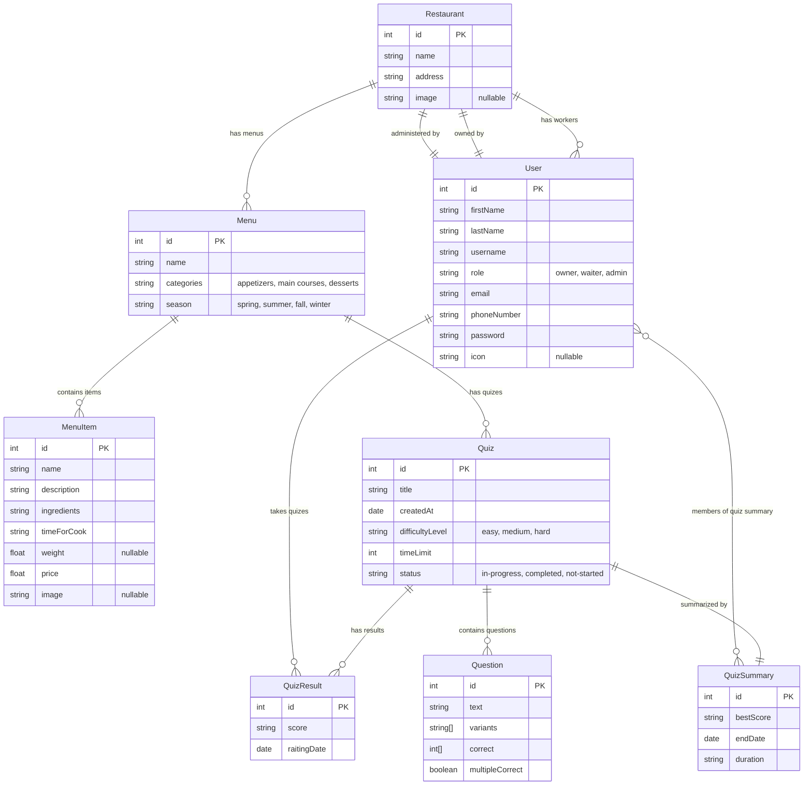

# Restaurant Management System - Entity Relationship Diagram

## Entity Descriptions

### Core Entities

- **User**: Represents system users (owners, waiters, admins)
- **Restaurant**: Restaurant information and settings
- **Menu**: Seasonal menu categories (appetizers, main courses, desserts)
- **MenuItem**: Individual food items with details and pricing

### Quiz System Entities

- **Quiz**: Training quizes for staff with difficulty levels
- **Question**: Quiz questions with multiple choice answers
- **QuizResult**: Individual quiz attempt results
- **QuizSummary**: Aggregated quiz performance data

## Key Relationships

1. **Restaurant-User**: One restaurant has many workers, one owner, and optionally one admin
2. **Restaurant-Menu**: One restaurant has multiple seasonal menus
3. **Menu-MenuItem**: Each menu contains multiple food items
4. **Menu-Quiz**: Each menu can have associated training quizes
5. **Quiz-Question**: Each quiz contains multiple questions
6. **User-QuizResult**: Users can take multiple quizes
7. **Quiz-QuizSummary**: Each quiz has one summary with multiple member participants

## Business Logic Notes

- Users have roles: `owner`, `waiter`, `admin`
- Menus are categorized by type and season
- Quiz system supports staff training with different difficulty levels
- Quiz results track individual performance over time
